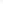

# Penrose, an esoteric language where code is layed out in aperiodic tile patterns

## How it works

There are many different algorithms to generate penrose tilings. We use a method where each shape can be divided into some number of smaller shapes, according to this diagram:

As you can see a "thick" rhomb can be deconstructed into rhombs A, B, and C while a thin rhomb can be divided into D and E.

Note the orientation is important. For example notice that A is flipped upside down. While the shape may look symetric the matching rules don't work if any shape is flipped the other way around.

A complicating factor is how the shapes do not perfectly fill the outer rhombs. However, this isn't actually an issue, since by the matching rules we know that that only certain sides can actually connect. We know the north side of the thick rhomb, which has a chunk missing, can only connect to the north side of the thin rhomb or the east side of the the thick rhomb, both of which have a part sticking out in the correct places.

The entire right half of the thin rhomb seems to be missing but it will always be
filled by a thick rhomb coming in from the south (bottom right) and a thin rhomb from the east (top right), making the final shape symetric.

### Coordinates

We can now use this to define a coordinate system. A coordinate consists of the letter followed by the next bigger tile that contains it. For example, an AEB means "An thick rhomb at the position A relative to a virtual larger thin rhomb at the E position relative to a hypothetical even bigger B tile".

However, we want to be able to represent coordinates on a potentially infinite plane, and having coordinates of infinite length is inconvenient. Thus we define a starting tile whose position will be at the pattern `CEDBAA` repeating forever. So if your coodinate is printed as `A` it will actually be be `AEDBAACEDBAACEDBAAA...`. 

### Traversing the grid

Now all we need is rules to cover how to traverse the grid. Each tile has 4 sides, North, East, South, and West, where north is represented by the left indentation. Now all we need to define for each side of every tile tipe where you would end up if you go that way. Some examples:

* If you go North from tile B, you end up coming in from the north side of the tile in the A position sharing the same parent tile.
* If you go East from tile B, you will leave the parent tile on the east side, specifically on the left half of the right half of that edge.

There are 20 such rules plus 10 more for what happens if you enter one of the large tiles from a specific edge, half edge, or quarter edge.

When leaving the parent tile, repeat the process for the parent's parent, and the parent's parent parent, until you reach an instruction that allows you to enter a tile, at which point you use the matching rule for what happens when entering a tile from a specifc edge until you reach a physical, first level tile again.

In some rare cases entering a tile form a specific angle connects directly back outwards. For example entering the thin rhomb from the south (bottom right) immediatly connects back out to the right half of the top. This rhomb is guarenteed to be filled by a thick rhomb from the tile that connects to the east edge. In this case the algorithm will transition from a inwards motion to an outwards motion again.

Some resources that where incredibly helpful working this out: https://tilings.math.uni-bielefeld.de/substitution/penrose-rhomb/ and https://en.wikipedia.org/wiki/Penrose_tiling

## Builtins

### Control Flow

Note: All directions are relative and will push you in a different direction depending on where you came from.

* `<` Turn Left, angles are relative
* `>` Turn Right
* `^` Turn left if the top of the stack is truthy
* `v` Turn right if the top of the stack is truthy
* `|` Turn around

* `(` less than
* `)` greater than
* `=` Equal

### Stack Manipulation

* `:` Duplicate the top element
* `#` Duplicate the top two elements
* `~` Pop the top element
* `s` Swap the top two elements
* `{}` Rotate the stack left or right
* `d` Pop a number then duplicate the top N elements
* `c` Push a copy Nth element of the stack
* `u` Unwrap an array onto the stack
* `a` Collect the top N elements of the stack into an array

### Strings

* `"` Start/End a string, pushed as seperate character values
* `'` Start/End a string, pushed as a single array
* <code>`</code> Push a single character

### Pushing Constants

* `0123456789` Push a value 0-9
* `π` Push PI
* `ϕ` Push the golden ratio
* `e` Push e

### Math

* `+-*/` Basic arithmetic. On arrays does concat, difference, product, 
* `!` Power
* `sc` Sine, Cosine
* `g` Natural Logarithm
* `_` Negate

### Input, Output

#### Input

* `c` Take a character as input
* `l` Take an entire line as input as an array
* `w` Take a word as input
* `n` Parse a word as a number and take that as input

#### Output

* `C` Output a character
* `W` Output an array at once
* `L` Pop N then output the top N characters from the stack, flattens over arrays
* `N` Output a number

### Arrays

* `[` Pop N then push the Nth item of an array
* `]` Pop N and R then set the Nth item of the array to R